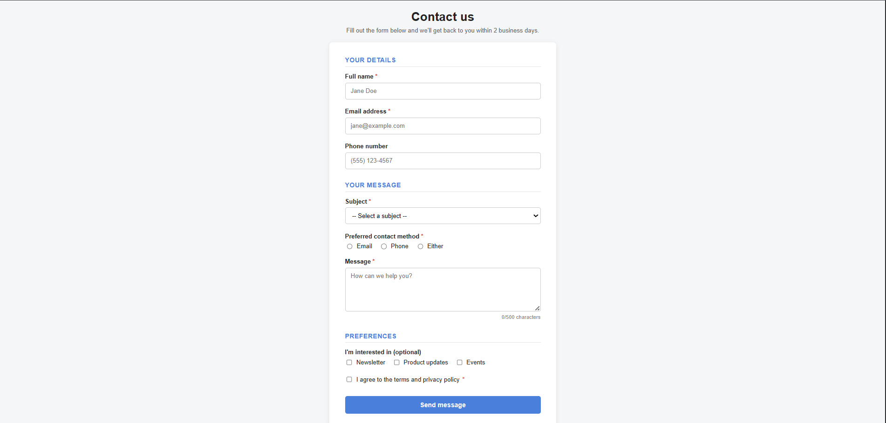

# 📩 Contact Form

A simple **Contact Form** built using **HTML5**. This project demonstrates the use of essential HTML form elements, input types, labels, and built-in form validation to collect user information.

## 🔗 Links

 **GitHub Repository:** https://github.com/veeranishanth/contact-form

 **Live Demo:** https://veeranishanth.github.io/HTML-Forms/
  
✨ Features

- Name, Email, Subject, and Message fields
- HTML5 input types
- Built-in form validation
- Semantic HTML structure
- Beginner-friendly code

## 🛠️ Technologies Used

- HTML5

## 📁 Project Structure

```text
contact-form/
├── index.html
└── README.md
```

## 🚀 Getting Started

1. Clone the repository:

```bash
git clone https://github.com/palrushideepthisree/contact-form.git
```

2. Open the project folder.

3. Open `index.html` in your preferred web browser.


## 📚 Learning Outcomes

- Understanding HTML forms
- Using different input types
- Applying HTML5 validation attributes
- Creating semantic and accessible form structures
  
## 📸 Screenshots



##  Author

**Nishanth Veera**

- GitHub: https://github.com/veeranishanth
- LinkedIn: https://www.linkedin.com/in/nishanthveera/

## 📄 License

This project is licensed under the **MIT License**.

---

⭐ If you found this project helpful, consider giving it a **star** on GitHub!
